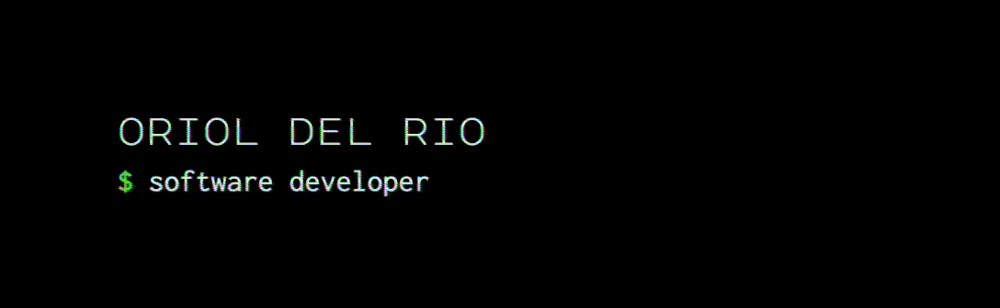

# 👋🏻 Hello!

I'm a Software Developer and a tech enthusiast based in Barcelona. My area of expertise involves building backend services in a distributed, scalable and resilient way. I've worked in Agile teams developing software for high-concurrency environments.

# 👨🏻‍💻 Tech

I feel comfortable with:

- Scala (Cats, Play Framework, FS2, http4s) —alternatively, Kotlin or Java
- PHP (Symfony, PSR)
- Functional Programming
- DDD, CQRS & Ports and adapters architecture
- MySQL & Redis
- AWS (DynamoDB, Aurora, EKS, SNS & SQS)
- Terraform
- Kubernetes
- Unit, integration and acceptance testing
